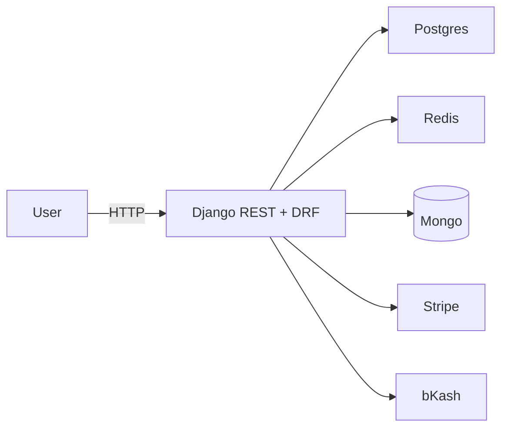
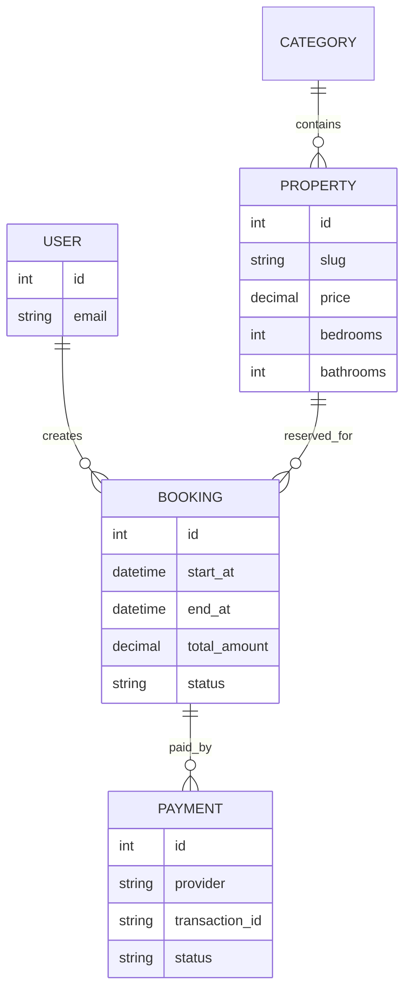

# Luxury Real Estate Backend (Django + DRF)

Backend for luxury real estate with users, properties, slot-based bookings, and payment flows (Stripe + bKash). JWT auth via SimpleJWT on top of Django auth (email as username). Swagger docs, Postman collection, Redis cache, optional Mongo for media metadata. Password reset flow + user panel HTML.

## Quick start (SQLite dev)
```bash
python -m venv venv
.\venv\Scripts\python -m pip install -r requirements.txt
.\venv\Scripts\python manage.py migrate
.\venv\Scripts\python manage.py seed_demo  # admin@example.com / Admin123!
.\venv\Scripts\python manage.py runserver
```

## PostgreSQL + Redis + Mongo (preferred)
- Copy `.env.example` to `.env` and set `POSTGRES_*`, `REDIS_URL`, `MONGO_URI` values.
- Option A: `docker-compose up -d` (starts Postgres, Redis, Mongo).
- Option B: point to your own services via env vars.
- Run `.\venv\Scripts\python manage.py migrate` after DB is up.

## Env vars
- `STRIPE_SECRET_KEY` (required for live Stripe)
- `STRIPE_WEBHOOK_SECRET` (for webhook verification)
- `BKASH_BASE_URL`, `BKASH_APP_KEY`, `BKASH_APP_SECRET`, `BKASH_USERNAME`, `BKASH_PASSWORD`
- `REDIS_URL` (defaults to redis://localhost:6379/1 if `USE_REDIS=true`)
- `MONGO_URI`, `MONGO_DB_NAME` for media metadata

## Auth endpoints
- `POST /auth/register` – {email, password}
- `POST /auth/login` – {email, password}
- `GET /auth/me`
- `GET /auth/me/bookings`
- `GET /auth/me/payments`
- `POST /auth/token/refresh` / `POST /auth/token/verify`
- HTML pages: `/login/` and `/register/` (store JWT in localStorage), admin at `/admin/`
- Password reset: `/auth/password-reset/` → email link → `/auth/reset/<uid>/<token>/`
- User panel: `/panel/` (uses JWT from localStorage to show bookings/payments and book)

## Public property endpoints
- `GET /api/categories/`
- `GET /api/properties/`
- `GET /api/properties/<slug>/`
- `GET /api/properties/<slug>/recommendations/` (DFS + cached category graph)

## Booking endpoints (auth)
- `POST /api/bookings/create/` {property_id, start_at, end_at ISO} – blocks overlapping pending/paid slots
- `GET /api/bookings/`
- `POST /api/bookings/<id>/cancel/` – cancels if not paid

## Payments (auth unless webhook)
- `POST /api/payments/initiate/` {provider: stripe|bkash, booking_id} – double-pay guard; reuses pending intent
- `POST /api/payments/webhook/stripe/` (no auth)
- `POST /api/payments/webhook/bkash/` (no auth; updates status)
- `POST /api/payments/bkash/execute/` (auth, uses stored payment_id)
- `GET /api/payments/bkash/query/?payment_id=` (auth)

## Docs & Tests
- Swagger UI: `/api/docs/`; OpenAPI JSON: `/api/schema/`
- Postman: `docs/postman_collection.json`
```bash
.\venv\Scripts\python manage.py test
```

## Notes
- Payments use a strategy pattern (`payments/services.py`); Stripe uses PaymentIntent; bKash integrates token + create + execute + query (falls back to mock if not configured).
- Slot availability: no overlapping pending/paid bookings for the same property (start/end datetimes).
- Caching: category graph cached (Redis by default if available, else locmem).
- Mongo helper: property media metadata pulled from Mongo if available.

## Diagrams (Mermaid)



